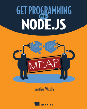

# Manning - [Get Programming with Node.js](https://www.manning.com/books/get-programming-with-node-js)

## Introduction

A nice and easy way to set up a Node.js development environment is by using a virtual machine. It's nice because no applications and tools, are installed on your local machine. It's easy because the virtual machine is created by a configuration file. This makes it easy to create the virtual machine when needed, but also easy to destroy it, once it is no longer needed.

__Pros__
- Works all the same on Windows, Linux, OS-X
- No installation of applications and tools on your local machine
- The virtual machine contains all the applications / tools as used in the book
    - nodejs
    - npm
    - MongoDB

__Cons__
- Takes up more memory and cpu, then running things locally.
- Takes up disk space, as long as the virtual machine exists.

## Environment set up

In case you don't have VirtaalBox or Vagrant, download and install these programs:

- [VirtualBox](https://www.virtualbox.org/)
- [Vagrant](https://www.vagrantup.com/intro/index.html)

Clone this GitHub project, to get the Vagrant configuration file(s).

    git clone https://github.com/verhagen/get-programming-with-nodejs.git

> **Background**
>
> The Vagrant configuration file `Vagrantfile` is based on the Vagrant box [`ubuntu/xenial64`](https://app.vagrantup.com/ubuntu/boxes/xenial64). On this Ubuntu the [Node Version Manager (nvm)](https://github.com/creationix/nvm) is being installed. Then `nvm` is used to install [Node Package Manager (npm)](https://www.npmjs.com/) and [Node.js](https://nodejs.org/).
>
> At the top of the `Vagrantfile` the nvm version and node version are set.

## Using the Virtual Machine

Vagrant uses the configuration file `Vagrantfile` to create a virtual machine. In this scenario it creates a VirtualBox
virtual machine.

Launch the virtual machine

    vagrant up

Go into the virtual machine (guest)

    vagrant ssh

Inside the guest, go to the shared directory which is synchronized with the hosts project directory.

    cd /vagrant

Leave the virtual machine (guest)

    exit

Stop the VirtualBox machine. But keep it for quick relaunch.

    vagrant halt

Destroy the virtual machine. This stops and removes the virtual machine. Less disk space usage. Longer to launch again.

    vagrant destroy

To remove all Vagrant boxes, first list the boxes and then remove them.

    vagrant box list

    vagrant box remove <name>

## Start Developing

Once the virtual machine, created by Vagrant, is up, get inside it through `vagrant ssh` and goto the `/vagrant` directory. This directory is mounted from the host.

So all files created here or on the host machine will persist on the host machine. This makes it also possible to edit files on the host as well as on the guest.

This mount points to the project directory `get-programming-with-nodejs` on the host.

Inside the virtual machine one can run `npm`, `node` and others applications. Try some commands like:

    npm --version
    node --version

### Cloning the Books Lessons

On the host machine, goto the git project directory `get-programming-with-nodejs`. Inside this git project, clone the source code from the book, as git sub-module `exercise`:

    git submodule add https://github.com/JonathanWexler/get-programming-with-nodejs.git exercise

This will create a directory `exercise` which contains all the books units and lessons.

**Port Forwarding**

Node runs on port `3000`, which is made available to the host as well.

### Mongodb

**Port Forwarding**

Mongodb runs on port `27017`, which is made available to the host as well.
